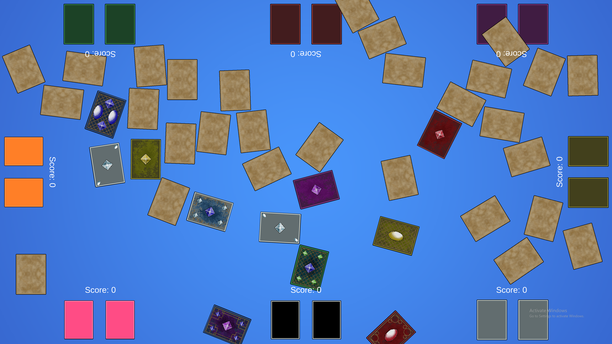
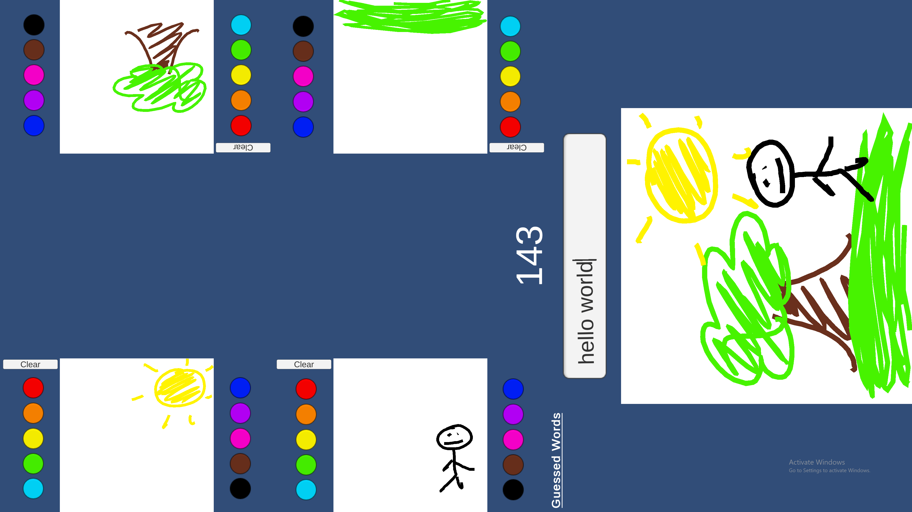
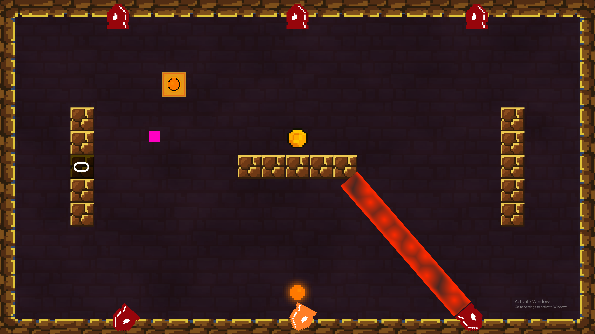
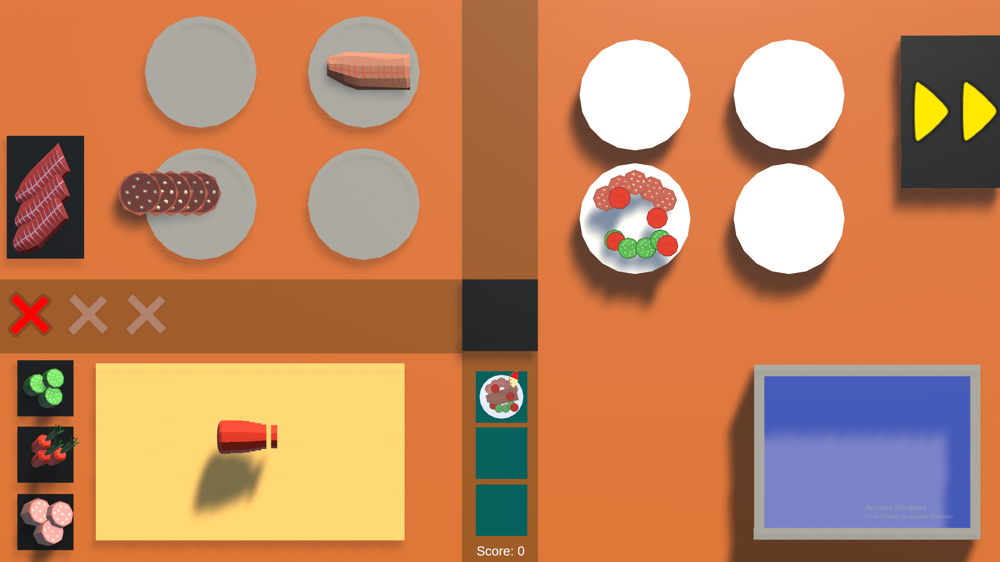
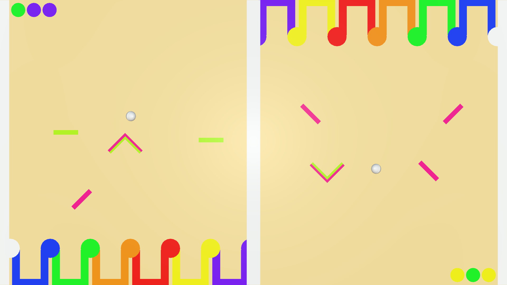

# Massively-multi-touch-games
This is a collection of Unity projects that were created to explore a design space for massively multi-touch games.

## Card Match
This demo is similar to the classic card game Memory, where players have to flip over 2 cards in an attempt to find a matching pair. In this version up to 8 players search for matching cards and drag them into thier "card zones" to earn points.

### File Structure
This project has files for an unused air hockey style demo and a recreation of the card game "Spoons". The air hockey does not work, but the other demo does.

**Air Hockey** Contains everything for the air hockey demo.

**Card Game** This contains everything for the Spoons recreation.

**Card Match** This contains all of the scripts, images and prefabs that were specific to the card match demo. The Cards folder contains the card prefabs and the Card Sprites folder contains the sprites for the prefabs. All other folders are scripts for the game logic.

**General Scripts** This contains a single script that was used across all the game demos.

**Imported Assets** This contains any assets or packages that were imported from the Unity Asset Store or Unity Registry.

**Resources** This was used to change the images of the cards in the Spoons recreation.

**Scenes** This contains all the scenes in the project. The Main Menu and Card Match scenes are the main two that are used. The Sample Scene has the broken air hockey demo and the Spoons folder has all of the scenes for the Spoons recreation.

## Drawing Game
This demo is similar to Pictionary, where the drawers are given a word or phrase to draw and the guesser has to guess what they are deawing. The catch here is that the guesser sees all of the drawings stacked on top of each other.

### File Structure

**Prefabs** This contains all of the line render prefabs used to draw in different colors.

**Scenes** This contains the two scenes used in the project. The Sample Scene is used for the actual demo and the Menu scene is the main menu.

**Scripts** This contains all the scripts used in the project.

**Settings** This contains all the settings for the Universal Render Pipeline.

**Text Mesh Pro** This contains the imported Text Mesh Pro package.

## Laser Game
In this demo there is 1 player that controls a small square using a controller or keyboard. Thier goal is to collect as many randomly spawned coins as possible. There are 6 cannons on the screen that are used by everyone else to eliminate the controller player.

### File Structure
This project contains scripts and images for an unused train demo and two player racing demo. Both of these were scrapped either due to being too complex or just not fun.

**Images** This contains any of the edited or custom images that I used in this demo.

**Imported Assets** This contains any assets or packages that were imported from the Unity Asset Store or Unity Registry.

**Materials** This contains the materials that were used for the laser rendering, as well as the laser shader graph.

**Particles** This contains all of the particle effects used, except for the laser buil up effect. This is because the effect is attached to an empty gameobject, which made it easier to rotate and attach to the cannons.

**Prefabs** This contains any prefabs that were used, including the laser build up particle effect. It also has the bounce physics material that was used for the fireball.

**Rendering** This contains the files that are needed for the Universal Rendering Pipeline.

**Scenes** This contains all the scenes in the project. The two that are used are ControllerGame and MainMenu. The other two were for the scrapped demo ideas.

**Scripts** This contains all the scipts used in the project. The SimpleRace and Trains folders were for the scrapped demo ideas and are not used in the main demo. The Player folder refers to the controller player and the cannons folder is everything to do with the firing of the cannons, not the rotation.

## Minigames and Cooking
This project contains two demos. The first is a demo similar to WarioWare where 2 players are given a short minigame to complete. The first person to complete it gets a point and another minigame is presented. This happens until 1 of the players reaches 7 points. The second is similar to overcooked in that orders are given to the player(s) and they have to prepare ingredients to complete the dish in a certain amount of time to gain points.

### File Structure

**Cooking** This contains the images, prefabs and scripts that were used to create the cooking demo.

**Game Modes** This contains most of the scripts and assets used in the minigames game modes. Each mode is seperated into its own folder with its individual script and assets. There is also a General Scripts folder that contains scripts that were used across gamemodes or for menus.

**Imported Assets** This contains any assets or packages that were imported from the Unity Asset Store or Unity Registry.

**Materials** This contains any materials that were used in the cooking demo to color the scene.

**Menus** This contains the main menu script and the game over script for the mingames.

**Particles** This contains the script that destroys particles after a certain period of time and an unused particle prefab.

**Resources** This contains the sprites for the cooking demo guides and orders.

**Scenes** This contains all the scenes in the project. The Menus folder has all the demo menus. The Modes In Rotation has all of the minigames used in the minigame demo. The Other Games folder has the cooking demo scene and the Unused Modes folder has scenes for minigames that were not used.

**Touch Interactions** This contains scripts relating to touch screen interactions. None of these are specific to any game demo and are either used in multiple demos or are built off of for certain logic in the demos.

## Physics Game
In this game a ball is dropped on either side of the screen and the players have to move objects around to guide it into a colored box corresponding to a pattern they are given.

### File Structure

**Materials** This contains all the materials used to color the objects in the project. It also contains the physics materials used to make the ball bounce off certain objects.

**Particles** This contains all the particles that are used when a ball lands in a bucket.

**Prefabs** This contains all of the prefabs used in the demo, including the boxes, balls and movable pieces.

**Scenes** This contains the one scene used in the project.

**Scripts** This contains all of the scripts used in the project.

**Text Mesh Pro** This contains the imported Text Mesh Pro package.

## Assets Used In Projects
All assets were found in the Unity Registery or were free from the Unity Asset Store

**Package:** TextMeshPro  
**Used In:** All

**Package:** [Free 2D Mega Pack](https://assetstore.unity.com/packages/2d/free-2d-mega-pack-177430)  
**Used In:** Laser Game, Card Match, Minigames and Cooking Game

**Package:** [Free Playing Cards Pack](https://assetstore.unity.com/packages/3d/props/tools/free-playing-cards-pack-154780)

**Used In:** Card Match

**Package:** [2D Modular Cards KIT DEMO](https://assetstore.unity.com/packages/2d/gui/2d-modular-cards-kit-demo-227623)

**Used In:** Card Match

**Package:** [2D Casual UI HD](https://assetstore.unity.com/packages/2d/gui/icons/2d-casual-ui-hd-82080)  
**Used In:** Card Match, Minigames and Cooking Game

**Package:** [Cutlery Silverware PBR](https://assetstore.unity.com/packages/3d/props/food/cutlery-silverware-pbr-106932)  
**Used In:** Card Match

**Package:** [Fish - PolyPack](https://assetstore.unity.com/packages/3d/characters/animals/fish/fish-polypack-202232)  
**Used In:** Minigames and Cooking Game

**Package:** [Simple Foods](https://assetstore.unity.com/packages/3d/props/food/simple-foods-207032)  
**Used In:** Minigames and Cooking Game

**Package:** [Low Poly Fruit Pickups](https://assetstore.unity.com/packages/3d/props/food/low-poly-fruit-pickups-98135)  
**Used In:** Minigames and Cooking Game

**Package:** [Traffic Control Resource Pack](https://assetstore.unity.com/packages/2d/environments/traffic-control-resource-pack-20085)  
**Used In:** Minigames and Cooking Game

**Package:** [Food Icons Pack](https://assetstore.unity.com/packages/2d/gui/icons/food-icons-pack-70018)  
**Used In:** Minigames and Cooking Game

**Package:** [Simple ParticlesFX: Toon Effects](https://assetstore.unity.com/packages/vfx/particles/simple-particles-fx-toon-effects-244171)  
**Used In:** Minigames and Cooking Game

**Package:** [Low Poly Rock Models](https://assetstore.unity.com/packages/3d/environments/low-poly-rock-models-119245)  
**Used In:** Minigames and Cooking Game

**Package:** [Food Pack | Free Demo](https://assetstore.unity.com/packages/3d/props/food/food-pack-free-demo-225294)  
**Used In:** Minigames and Cooking Game